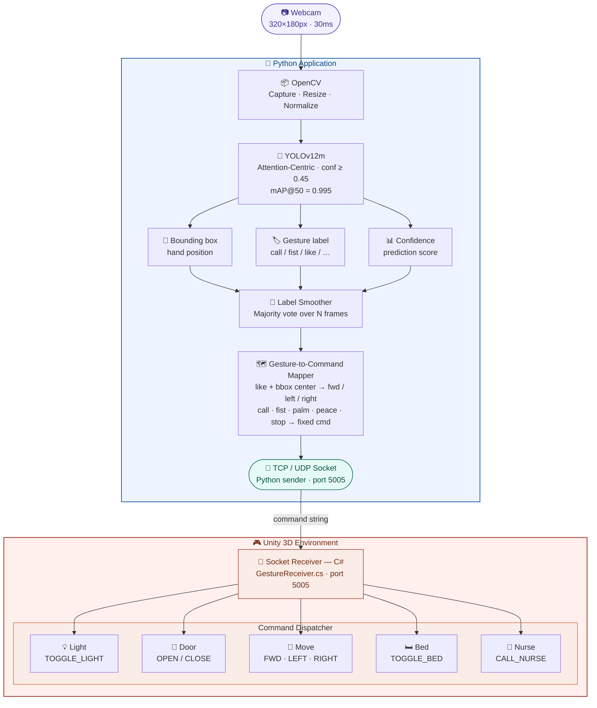

# Real-Time Hand Gesture Recognition & Unity 3D Control

<div align="center">


**A real-time hand gesture recognition system using YOLOv12m, fine-tuned on 6,000 images from the HaGRID dataset, with live gesture-to-command mapping into a Unity 3D smart-home simulation - contactless, no wearable required.**

[Full Thesis](#) · [Demo Video](#) · [Model Weights](#) · [Issues](../../issues)

</div>

---

## Table of Contents

- [Overview](#-overview)
- [Features](#-features)
- [System Architecture](#-system-architecture)
- [Dataset](#-dataset)
- [Installation](#-installation)
- [Usage](#-usage)
- [Experimental Results](#-experimental-results)
- [Gesture → Unity Mapping](#-gesture--unity-mapping)
- [Project Structure](#-project-structure)
- [Limitations & Future Work](#-limitations--future-work)

---

## Overview

This project builds an end-to-end pipeline that recognizes **6 static hand gestures** from a live webcam feed and maps them directly to **8 control commands** inside a Unity 3D smart-home environment, including toggling lights, opening/closing doors, calling a nurse, adjusting a hospital bed, and moving a character (forward/left/right).

The detection backbone is **YOLOv12m** with an Attention-Centric architecture (NeurIPS 2025), achieving higher accuracy than CNN-based predecessors while maintaining real-time speed. The user interface is built with **PyQt6**, video processing with **OpenCV**, and the entire pipeline runs on a standard CPU (Intel Core i5) without requiring a dedicated GPU.

**Potential applications:**
- Assistive technology for people with limited mobility
- Contactless smart home control
- Touchless interfaces in medical or sterile environments
- Gaming and AR/VR interaction

---

## Features

| Feature | Details |
|---|---|
| **Real-time inference** | 38 - 55 FPS on Intel Core i5-12500H CPU, latency < 50ms |
| **6 gesture classes** | call, fist, like, palm, peace, stop |
| **Fine-tuned YOLOv12m** | mAP@50 = 0.995, mAP@50-95 = 0.840 on 1,200-image test set |
| **Unity 3D control** | Maps gestures to 8 commands in a smart-home simulation |
| **Spatial navigation** | `like` gesture maps to 3 directions (forward/left/right) based on bbox center position |
| **PyQt6 GUI** | Displays bounding boxes, labels, confidence, and FPS in real time |
| **CPU-only deployment** | No GPU required for inference |
| **Result smoothing** | Most-frequent-label voting over a sliding window of frames |

---

## System Architecture



## Dataset

Data was extracted from **HaGRID** (HAnd Gesture Recognition Image Dataset) and manually annotated using LabelImg in YOLO format:

| Property | Training Run 1 | Training Run 2 |
|---|---|---|
| Total images | 4,800 | 6,000 |
| Images per class | 800 | 1,000 |
| Gesture classes | 6 | 6 |
| Train / Val / Test split | 60% / 20% / 20% | 60% / 20% / 20% |
| Test set size | 960 images | 1,200 images |
| Source resolution | 1920×1080 px | 1920×1080 px |
| Annotation tool | LabelImg (YOLO format) | LabelImg (YOLO format) |

**Supported gesture classes:**

| ID | Gesture | Description |
|---|---|---|
| 0 | `call` | Thumb and pinky extended |
| 1 | `fist` | Closed fist |
| 2 | `like` | Thumbs up |
| 3 | `palm` | Open palm facing camera |
| 4 | `peace` | Index and middle finger extended (V sign) |
| 5 | `stop` | Open hand, thumb tucked in |

---

## Installation

### System Requirements (demo / inference)

| Component | Specification |
|---|---|
| CPU | Intel Core i5 12th gen or equivalent |
| RAM | 8 GB |
| OS | Windows 11 |
| Python | 3.10.x |
| Webcam | Minimum 640×480 px |
| GPU | Not required (CPU-only) |

### Training Environment (optional)

| Component | Specification |
|---|---|
| Platform | Google Colaboratory |
| GPU | NVIDIA Tesla T4 16 GB VRAM |
| Python | 3.12.13 |
| Ultralytics | 8.4.33 |
| PyTorch | 2.10.0+cu128 |

### Setup

```bash
# 1. Clone the repository
git clone https://github.com/hgtyt2039-cyber/hgtyt_hand-gesture-yolo12.git
cd hgtyt_hand-gesture-yolo12

# 2. Create a virtual environment
python -m venv venv
venv\Scripts\activate          # Windows
# source venv/bin/activate     # Linux/macOS

# 3. Install dependencies
pip install ultralytics opencv-python pyqt6 torch
```

### Download Model Weights

Place the `best.pt` file (training run 2, fine-tuned on 6,000 images) in the `models/` directory:

```
models/
└── best.pt
```

---

## Usage

### Run the full application (gesture recognition + Unity control)

```bash
# Step 1: Open the Unity project and press Play
# Step 2: Start the Python application
python gesture_app.py
```
---

## Experimental Results

### Two-run training comparison

| Metric | Run 1 | Run 2 | Improvement |
|---|---|---|---|
| Dataset size | 4,800 images (800/class) | 6,000 images (1,000/class) | +25% data |
| Epochs | 50 | 40 | Fine-tuned from Run 1 |
| mAP@50 | 0.994 | **0.995** | +0.001 |
| mAP@50-95 | ~0.830 | **~0.840** | +0.010 |
| Recall (conf > 0.85) | Drops quickly | **Stays high** | Fewer missed detections |
| palm ↔ like confusion | Present | **Largely resolved** | — |
| Precision / Recall overall | ~0.98–1.0 | **~0.99–1.0** | More stable |

### Per-class results on test set (1,200 images - Run 2)

| Class | Precision | Recall | Notes |
|---|---|---|---|
| call | ~0.99 | ~0.99 | Near-perfect |
| fist | ~0.99 | ~0.99 | Near-perfect |
| peace | ~0.99 | ~0.99 | Near-perfect |
| stop | ~0.99 | ~0.99 | Near-perfect |
| palm | ~0.99 | ~0.99 | 1% confused with background |
| like | ~0.99 | ~0.99 | Minor 1% errors |

**mAP@50 = 0.995 | mAP@50-95 = 0.840 | Optimal F1 at conf ≈ 0.35**

### Real-time performance (CPU-only, Intel Core i5-12500H)

| Environment condition | FPS | Latency | Accuracy |
|---|---|---|---|
| Normal lighting, 0.5 m distance | ~45 FPS | < 50ms | 98% |
| Dim lighting, 1 m distance | ~35 FPS | < 70ms | 92% |
| Hand tilted 45° | ~40 FPS | < 60ms | 85% |
| Complex background | ~38 FPS | < 60ms | 88% |

---

## 🎮 Gesture → Unity Mapping

| Gesture | Unity Command | Action in the 3D environment |
|---|---|---|
| ☎️ `call` | `CALL_NURSE` | Nurse character appears |
| ✊ `fist` | `CLOSE_DOOR` | Door closes |
| ✋ `palm` | `OPEN_DOOR` | Door opens |
| ✌️ `peace` | `TOGGLE_BED` | Hospital bed raises / lowers |
| 🖐️ `stop` | `TOGGLE_LIGHT` | Room light toggles on/off |
| 👍 `like` (bbox center in middle third) | `MOVE_FORWARD` | Character moves forward |
| 👍 `like` (bbox center in right third) | `MOVE_RIGHT` | Character moves right |
| 👍 `like` (bbox center in left third) | `MOVE_LEFT` | Character moves left |

> **Special spatial navigation mechanism:** The camera frame is divided into three equal vertical zones. The horizontal position of the bounding box center determines the direction command — enabling 3-way navigation from a single gesture without retraining or adding new classes.

---

## 📁 Project Structure

```
hgtyt_hand-gesture-yolo12/
├── data/                         # Dataset (after preparation)
│   ├── images/
│   │   ├── train/                # 60% 
│   │   ├── val/                  # 20% 
│   │   └── test/                 # 20% 
│   └── labels/                   # YOLO .txt annotations
│       ├── train/
│       ├── val/
│       └── test/
├── models/
│   └── best.pt                   # Best weights from training run 2
├── runs/                         # Ultralytics training outputs
│   └── detect/
│       ├── train/                # Run 1 results
│       └── gesture_v2_L2/        # Run 2 results
├── unity/                        # Unity project
│   └── Scripts/
│       └── GestureReceiver.cs    # C# socket receiver
├── gesture_app.py                # Main app PyQt6 + OpenCV + YOLOv12
├── gesture.yaml                  # Ultralytics dataset config
├── requirements.txt
└── README.md
```

---

## 👤 Author

**Hoang Anh Tuyet** 
- GitHub: [@hgtyt2039-cyber](https://github.com/hgtyt2039-cyber)

---

<div align="center">
If this project is useful to you, please give it a ⭐ Star!
</div>
